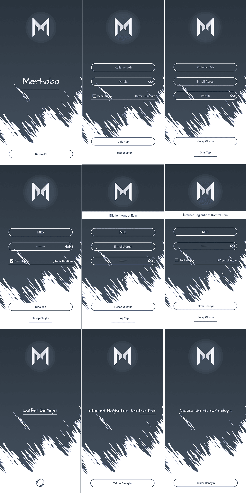

# Android Kullanıcı Kontrolü | Node.js API - MongoDB | Welcome | Login | Signup

### Android Kullanıcı Kontrolü nedir?
  
  Birçok uygulamada aslında kullanmaya alışık olduğumuz, kullanıcının uygulamaya giriş yapmasını, kayıt olmasını, uygulamayala ilk karşılaşmasını sağlayan bir kütüphane geliştirdim. Kütüphane Node.js ile geliştirmiş olduğum Api'ler ile kullanılmaktadır. Veritabanı olarak MongoDB ve MySQL kullanılmıştır. İstediğiniz şekilde özelleştirebilirsiniz.

### Kütüphane ile neler yapılabilir?

  - Uygulama versiyon kontrolü.
  - Uygulamanın geçici olarak hizmet dışı bırakılması. 
  - Uygulamanın ilk kurulumunda kullanıcıyı karşılaması.
  - Uygulamanın internet erişimi ve Web Servis erişimi kontrolü.
  - Uygulamaya kullanıcının kayıt olabilmesi.
  - Uygulamaya kullanıcının giriş yapabilmesi.
  - Uygulamada Beni Hatırla seçeneği.
  - Uygulamayı kullanıcı tekrar açtığında direk kontrol edilip giriş yapması.
  - Uygulamayı kullanıcı tekrar açtığında yeni cihazda oturum açtı ise önceki cihazda oturumun kapatılması.
  - Uygulamada kullanıcının oturumu kapatabilmesi.
  
### Uygulama

  - 

### Galeri

